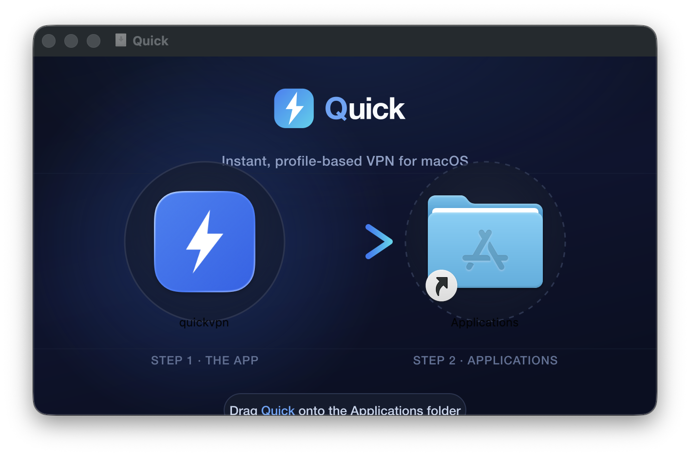
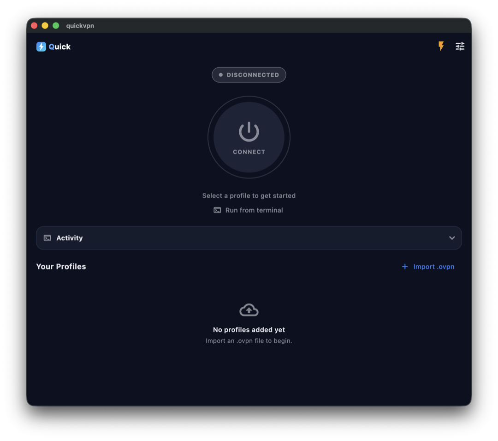
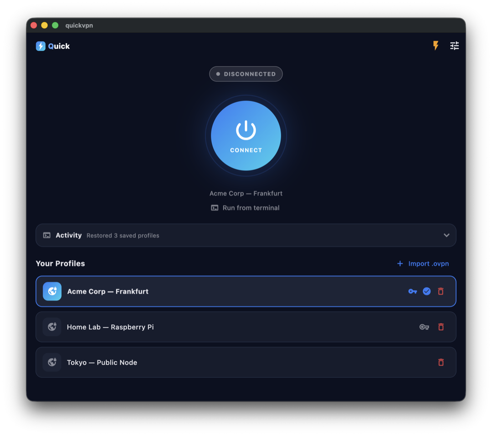
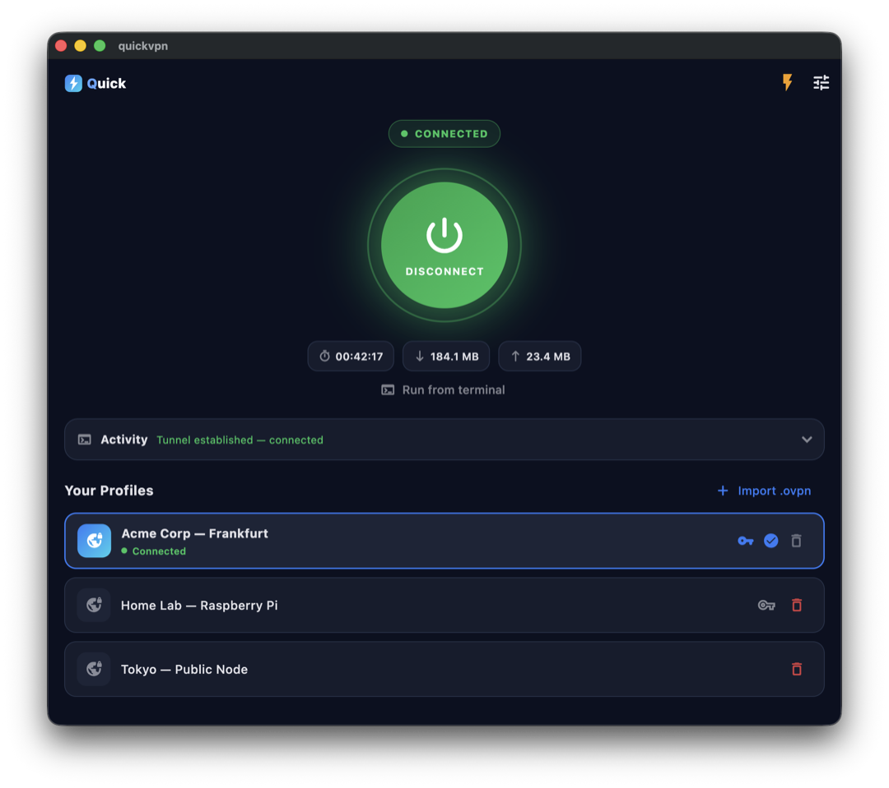

<div align="center">

# ⚡ QuickVPN

**A sleek, fast OpenVPN client built with Flutter.**
Import your `.ovpn` profiles, see them in a clean vault, and connect with a single tap.




<sub>The branded macOS installer, built with <code>make dmg</code>.</sub>

<sub>QuickVPN by <a href="https://refactorroom.com">refactorroom.com</a></sub>

</div>

---

## ✨ Highlights

- **Import** `.ovpn` profiles from disk into a tidy **profile vault**.
- **Connect / disconnect** with one tap on a big power orb.
- **Credentials** — profiles using `auth-user-pass` get a 🔑 to store a
  username/password; you're auto-prompted on first connect.
- **Live metrics** — connection duration and throughput (▼ in / ▲ out) while
  connected.
- **Activity log** — a running feed of exactly what the engine is doing.
- **Selection safeguard** — you can't switch the active profile mid-session.
- **Run from terminal** — copy a ready-made `openvpn` command for any profile,
  so it works without QuickVPN too.

## 📲 From import to connected

<table>
  <tr>
    <td align="center">
      <br>
      <b>1 · Import</b><br>The vault starts empty — bring in an <code>.ovpn</code> file.
    </td>
  </tr>
  <tr>
    <td align="center">
      <br>
      <b>2 · Select &amp; set credentials</b><br>Pick a profile; tap the 🔑 to store a username/password for <code>auth-user-pass</code> profiles.
    </td>
  </tr>
  <tr>
    <td align="center">
      <br>
      <b>3 · Connect</b><br>Tap the orb and authenticate when macOS asks — status walks <code>CONNECTING → … → CONNECTED</code>.
    </td>
  </tr>
  <tr>
    <td align="center">
      <br>
      <b>4 · Connected</b><br>Live duration and ▼ in / ▲ out throughput while the tunnel is up.
    </td>
  </tr>
</table>

## 🖥️ Platform support

| Platform | Tunnel | How |
|----------|:------:|-----|
| **Android** | ✅ | [`openvpn_flutter`](https://pub.dev/packages/openvpn_flutter) (bundled native OpenVPN engine) |
| **iOS** | ✅ | `openvpn_flutter` (requires a Network Extension target + paid Apple Developer account) |
| **macOS** | ✅ | Pure-Dart launcher driving the `openvpn` binary via its management interface — **no Apple Developer account, no Network Extension** |
| **Linux** | ✅ | Same launcher; gains root via PolicyKit (`pkexec`) or passwordless `sudo` |
| **Windows** | ✅ | Same launcher; relaunches `openvpn.exe` elevated through UAC |

### Why the desktop is special

`openvpn_flutter` ships **only** Android and iOS implementations, and Apple's
"correct" macOS path (a Network Extension `PacketTunnelProvider`) is gated
behind a paid Apple Developer Program membership. So on **every desktop OS**
QuickVPN takes the **launcher** approach — the same mechanism Tunnelblick and
OpenVPN-GUI use, shared in `lib/vpn/base_cli_vpn_controller.dart`:

1. It spawns the real, battle-tested `openvpn` CLI (it does **not** reimplement
   the OpenVPN protocol).
2. It controls and monitors that process over OpenVPN's **management interface**
   — a local loopback socket — for status, throughput, credentials, and a clean
   disconnect.
3. Creating the tunnel device needs root/admin, gained per platform:
   - **macOS** — the native administrator dialog (default) or an optional,
     tightly scoped passwordless `sudoers` rule for seamless connects.
   - **Linux** — `pkexec` (graphical PolicyKit prompt), or passwordless `sudo`.
   - **Windows** — UAC elevation via `Start-Process -Verb RunAs`.

## 🚀 Getting started

### Prerequisites
- Flutter 3.44+ (Dart SDK `^3.12.2`)
- The `openvpn` client on the host (QuickVPN drives it; it shows an install
  banner with the right hint if it's missing):
  - **macOS:** `brew install openvpn` (looked up in the Homebrew `sbin` paths)
  - **Linux:** `sudo apt install openvpn` (or `dnf` / `pacman`); also `pkexec`
    from PolicyKit for the graphical auth prompt
  - **Windows:** the [OpenVPN community client](https://openvpn.net/community-downloads)
    (looked up under `C:\Program Files\OpenVPN\bin\openvpn.exe`)

### Run
```sh
flutter pub get

flutter run -d macos        # macOS
flutter run -d linux        # Linux
flutter run -d windows      # Windows
flutter run -d <android>    # Android emulator or device
```

> **macOS note:** the app sandbox is intentionally disabled (a sandboxed app
> cannot spawn `openvpn`/`osascript`), so distribution is outside the Mac App
> Store. Changing entitlements requires a **full rebuild**, not a hot restart.

### Connecting (macOS)
1. **Import .ovpn** → pick your profile.
2. Tap the 🔑 on the profile and enter your username/password (for
   `auth-user-pass` profiles).
3. Select the profile and tap the power button.
4. Authenticate in the macOS admin dialog → status walks
   `CONNECTING → AUTHENTICATING → … → CONNECTED`.
5. _Optional:_ tap ⚡ **"Make connections seamless"** to install a `sudoers`
   rule (scoped to only the `openvpn` binary, validated with `visudo`) so future
   connects need no password.

## 📦 Build installers

Each desktop OS builds on its own machine — Flutter can't cross-compile desktop
targets. Output filenames are versioned from `pubspec.yaml`. Run `make help` to
see all targets.

| Command | Run on | Produces |
|---------|--------|----------|
| `make dmg` | macOS | `build/quickvpn-v<version>.dmg` — branded, drag-to-Applications, logo as the volume **and** file icon. Needs `rsvg-convert` (`brew install librsvg`). |
| `make linux` | Linux | `build/quickvpn-v<version>-linux-<arch>.tar.gz` — bundle + `.desktop` entry, icon, and an `install.sh`. |
| `make win` | Windows | `build/quickvpn-v<version>-windows-x64-setup.exe` via [Inno Setup](https://jrsoftware.org/isdl.php) (logo as installer + app icon), or a `.zip` if `iscc.exe` isn't on PATH. |

Bump the version once in `pubspec.yaml` (e.g. `version: 1.2.0+5`) and every
installer filename tracks it automatically.

## 🗂️ Project structure

```
lib/
  main.dart                       UI (profile vault, toggle, credentials, metrics)
  main_demo.dart                  Screenshot harness — drives the UI to each state
  vpn/
    vpn_models.dart               Neutral VpnStage / VpnStats
    vpn_controller.dart           Abstract engine interface + request/readiness types
    vpn_controller_factory.dart   Picks the engine per platform
    management_parser.dart        Pure parser for the OpenVPN management protocol
    openvpn_locator.dart          Homebrew openvpn binary discovery
    privilege_helper.dart         macOS privilege model (admin dialog / sudoers)
    mac_vpn_controller.dart       macOS engine (launcher + management socket)
    mobile_vpn_controller.dart    Android/iOS engine (wraps openvpn_flutter)
test/
  vpn/management_parser_test.dart
  vpn/openvpn_locator_test.dart
  widget_test.dart                Smoke test with an injected fake controller
docs/superpowers/specs/           Design spec for the macOS engine
```

The UI talks only to the abstract `VpnController`; each platform's engine
implements it. This keeps mobile behavior untouched while macOS gets its own
pure-Dart implementation.

## 🧪 Testing

```sh
flutter analyze
flutter test
```

Pure logic (the management-protocol parser and binary discovery) is unit-tested.
The live macOS tunnel requires root, the admin dialog, and a real server, so it's
validated manually.

## 🔒 Security notes

- Passwords are sent only over the loopback management socket — **never written
  to disk**.
- Temp config files are created `0600` in a private directory and deleted on
  disconnect.
- The optional `sudoers` rule is scoped to the **single** `openvpn` binary path,
  `NOPASSWD` for that binary only, and validated with `visudo -c` before install.
- The management interface binds to `127.0.0.1` only.

## 📄 License

[MIT](LICENSE) © 2026 Akkarapon Phikulsri ([refactorroom.com](https://refactorroom.com))
